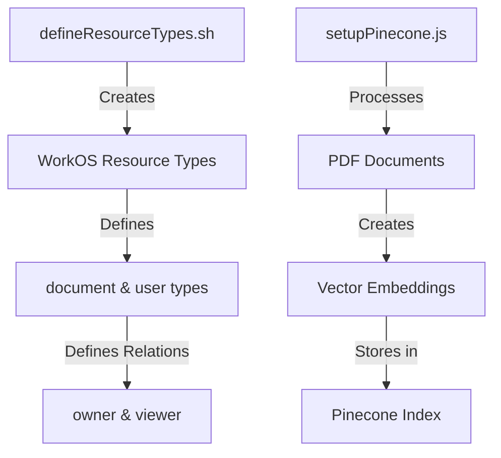
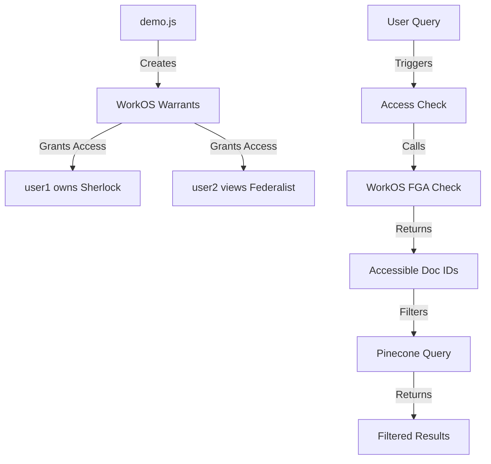

# Fine-Grained Authorization (FGA) Document Access Control POC


## Overview
This proof-of-concept and fully-runnable demo showcases fine-grained access control for document management using WorkOS FGA (Fine-Grained Authorization) integrated with the Pinecone vector database. 

This approach is suitable for Retrieval Augmented Generation (RAG) applications where you want to control access to documents used as context for LLM queries or returned to users.

## Supports 

- Document ownership and sharing permissions for a document-based application
- Access-controlled vector search based on user permissions
- Demonstration of permission inheritance and access control checks

## Prerequisites
- Node.js v20.5.0 or newer
- WorkOS API Key
- Pinecone API Key 
- OpenAI API Key 

## Usage

1. Copy environment variables and fill in secrets:
```bash
cp .env.example .env.local
# Edit .env.local with your API keys
```

2. Set up the WorkOS authorization model:

Visit the WorkOS FGA dashboard's schema section and enter the following code: 

```
version 0.1

type user

type document
    relation owner [user]
    relation viewer [user]

    inherit viewer if
        relation owner
```

3. Process documents and create vector embeddings:
```bash
node src/scripts/setupPinecone.js
```

4. Run the demo to test access controls and search:
```bash
node src/scripts/demo.js
```

<details>
<summary>Click to see expected demo output</summary>
=== Creating Basic Warrants ===
👤 Granted user1 owner access to "Sherlock Holmes"
👤 Granted user2 viewer access to "The Federalist Papers"

⏳ Waiting for initial warrants to propagate...

=== 🧪 Testing Access Controls and Search ===

--- Initial Access State ---

=== 🔍 Searching for user user1 with query: "What are the principles of justice and liberty?" ===

=== Checking document access for user: user1 ===
=== FGA Query Response ===
% [
  {
    resourceType: 'document',
    resourceId: 'doc_sherlock-holmes',
    relation: 'viewer',
    warrant: {
      resourceType: 'document',
      resourceId: 'doc_sherlock-holmes',
      relation: 'owner',
      subject: [Object]
    },
    isImplicit: true,
    meta: undefined
  }
]
✅ User has access to: Sherlock Holmes
✅ User can search in: Sherlock Holmes

=== Search Results ===

1. From "Sherlock Holmes":
   Score: 0.742918551
   Text: and seriously compromise one of the reigning families of Europe. To
speak plainly, the matter implicates the great House of Ormstein,
hereditary kings of Bohemia.”
“I was also aware of that,” murmured Holmes, settling himself
down in his armchair and closing his eyes.
Our visitor glanced with some apparent surprise at the languid,
lounging figure  of the man who had been no doubt depicted to him as
the  most  incisive reasoner and  most  energetic  agent  in  Europe.
Holmes slowly reopened his  eyes  and  looked impatiently at  his
gigantic client.
“If  your  Majesty would condescend to  state  your  case,” he
remarked, “I should be better able to advise you.”
The man sprang from his chair and paced up and down the room
in uncontrollable agitation. Then, with a gesture of desperation, he
tore the mask from his face and hurled it upon the ground. “You are
right,” he cried; “I am the King. Why should I attempt to conceal it?”
“Why,  indeed?” murmured Holmes. “Your  Majesty had  not

2. From "Sherlock Holmes":
   Score: 0.740908563
   Text: T h e   A d v e n t u r e s
o f   S h e r l o c k
H o l m e s
by Arthur Conan Doyle
Contents
I.A Scandal in Bohemia
II.The Red-Headed League
11/1/24, 1:33 PMThe Adventures of Sherlock Holmes | Project Gutenberg
https://www.gutenberg.org/files/1661/1661-h/1661-h.htm2/207

3. From "Sherlock Holmes":
   Score: 0.738290846
   Text: “Stolen.”
“My own seal.”
“Imitated.”
“My photograph.”
“Bought.”
“We were both in the photograph.”
“Oh, dear! That is very bad! Your Majesty has indeed committed
an indiscretion.”
“I was mad—insane.”
“You have compromised yourself seriously.”
“I was only Crown Prince then. I was young. I am but thirty now.”
“It must be recovered.”
“We have tried and failed.”
“Your Majesty must pay. It must be bought.”
“She will not sell.”
“Stolen, then.”
11/1/24, 1:33 PMThe Adventures of Sherlock Holmes | Project Gutenberg
https://www.gutenberg.org/files/1661/1661-h/1661-h.htm9/207

4. From "Sherlock Holmes":
   Score: 0.735623956
   Text: tore the mask from his face and hurled it upon the ground. “You are
right,” he cried; “I am the King. Why should I attempt to conceal it?”
“Why,  indeed?” murmured Holmes. “Your  Majesty had  not
spoken before I was aware that I was addressing Wilhelm Gottsreich
Sigismond von  Ormstein, Grand Duke  of  Cassel-Felstein, and
hereditary King of Bohemia.”
“But you can understand,” said our strange visitor, sitting down
once more and passing his hand over his high white forehead, “you
can understand that I am not accustomed to doing such business in
11/1/24, 1:33 PMThe Adventures of Sherlock Holmes | Project Gutenberg
https://www.gutenberg.org/files/1661/1661-h/1661-h.htm8/207

5. From "Sherlock Holmes":
   Score: 0.735244513
   Text: Count Von Kramm.”
“Then I shall drop you a line to let you know how we progress.”
“Pray do so. I shall be all anxiety.”
“Then, as to money?”
“You have carte blanche.”
“Absolutely?”
“I tell you that I would give one of the provinces of my kingdom
to have that photograph.”
“And for present expenses?”
The King took a heavy chamois leather bag from under his cloak
and laid it on the table.
“There are three hundred pounds in gold and seven hundred in
notes,” he said.
Holmes scribbled a  receipt upon  a  sheet  of  his  note-book and
handed it to him.
11/1/24, 1:33 PMThe Adventures of Sherlock Holmes | Project Gutenberg
https://www.gutenberg.org/files/1661/1661-h/1661-h.htm10/207

=== 🔍 Searching for user user2 with query: "What are the principles of justice and liberty?" ===

=== Checking document access for user: user2 ===
=== FGA Query Response ===
% [
  {
    resourceType: 'document',
    resourceId: 'doc_federalist-papers',
    relation: 'viewer',
    warrant: {
      resourceType: 'document',
      resourceId: 'doc_federalist-papers',
      relation: 'viewer',
      subject: [Object]
    },
    isImplicit: false,
    meta: undefined
  }
]
✅ User has access to: Federalist Papers
✅ User can search in: Federalist Papers

=== Search Results ===

1. From "Federalist Papers":
   Score: 0.819024861
   Text: of love, and that the noble enthusiasm of liberty is apt to be infected
with a spirit of narrow and illiberal distrust. On the other hand, it will
be equally forgotten that the vigor of government is essential to the
security of liberty; that, in the contemplation of a sound and well-
informed judgment, their interest can never be separated; and that a
dangerous ambition more often lurks behind the specious mask of
zeal for the rights of the people than under the forbidden appearance
of zeal for the firm ness and efficiency of government. History will
teach us that the former has been found a much more certain road to
the introduction of despotism than the latter, and that of those men
who have overturned the liberties of republics, the greatest number
have begun their career by paying an obsequious court to the people;
commencing demagogues, and ending tyrants.
In the course of the preceding observations, I have had an eye, my

2. From "Federalist Papers":
   Score: 0.79492259
   Text: denominations of men among us. To all general purposes we have
uniformly been  one  people each  individual citizen everywhere
enjoying the same national rights, privileges, and protection. As a
nation we have made peace and war; as a nation we have vanquished
our common enemies; as a nation we have formed alliances, and
11/1/24, 1:34 PMThe Project Gutenberg eBook of The Federalist Papers, by Alexander Hamilton, John Jay, and James Madison
https://www.gutenberg.org/files/1404/1404-h/1404-h.htm10/371

3. From "Federalist Papers":
   Score: 0.793835044
   Text: equally absurd to  aim  at  making proselytes by  fire  and  sword.
Heresies in either can rarely be cured by persecution.
And yet, however just these sentiments will be allowed to be, we
have already sufficient indications that it will happen in this as in all
former cases  of  great  national discussion. A  torrent of  angry  and
11/1/24, 1:34 PMThe Project Gutenberg eBook of The Federalist Papers, by Alexander Hamilton, John Jay, and James Madison
https://www.gutenberg.org/files/1404/1404-h/1404-h.htm7/371

4. From "Federalist Papers":
   Score: 0.793279707
   Text: malignant passions will be let loose. To judge from the conduct of
the  opposite  parties, we  shall  be  led  to  conclude that  they  will
mutually hope  to  evince the  justness  of  their  opinions, and  to
increase the  number of  their  converts  by  the  loudness of  their
declamations and the bitterness of their invectives. An enlightened
zeal for the energy and efficiency of government will be stigmatized
as the offspring of a temper fond of despotic power and hostile to the
principles of liberty. An over-scrupulous jealousy of danger to the
rights of the people, which is more commonly the fault of the head
than of the heart, will be represented as mere pretense and artifice,
the stale bait for popularity at the expense of the public good. It will
be forgotten, on the one hand, that jealousy is the usual concomitant
of love, and that the noble enthusiasm of liberty is apt to be infected
with a spirit of narrow and illiberal distrust. On the other hand, it will

5. From "Federalist Papers":
   Score: 0.792358816
   Text: magnitude to society. This circumstance, if duly attended to, would
furnish a  lesson of  moderation to  those  who  are  ever  so  much
persuaded of their being in the right in any controversy. And a further
reason for caution, in this respect, might be drawn from the reflection
that we are not always sure that those who advocate the truth are
influenced by  purer  principles than  their  antagonists. Ambition,
avarice, personal animosity,  party  opposition, and  many other
motives not more laudable than these, are apt to operate as well upon
those who support as those who oppose the right side of a question.
Were there not even these inducements to moderation, nothing could
be more ill-judged than that intolerant spirit which has, at all times,
characterized political  parties. For  in  politics, as  in  religion, it  is
equally absurd to  aim  at  making proselytes by  fire  and  sword.
Heresies in either can rarely be cured by persecution.

=== 🔍 Searching for user user3 with query: "What are the principles of justice and liberty?" ===

=== Checking document access for user: user3 ===
=== FGA Query Response ===
% []
❌ User has no document access
❌ User has no document access - skipping search

--- Sharing Document ---

=== 🤝 Sharing documents with useruser4 ===
✅ Shared "Sherlock Holmes" with useruser4
✅ Shared "Federalist Papers" with useruser4

⏳ Waiting to propagate changes...

--- Access After Sharing ---

=== 🔍 Searching for user user4 with query: "What are the principles of justice and liberty?" ===

=== Checking document access for user: user4 ===
=== FGA Query Response ===
% [
  {
    resourceType: 'document',
    resourceId: 'doc_sherlock-holmes',
    relation: 'viewer',
    warrant: {
      resourceType: 'document',
      resourceId: 'doc_sherlock-holmes',
      relation: 'viewer',
      subject: [Object]
    },
    isImplicit: false,
    meta: undefined
  },
  {
    resourceType: 'document',
    resourceId: 'doc_federalist-papers',
    relation: 'viewer',
    warrant: {
      resourceType: 'document',
      resourceId: 'doc_federalist-papers',
      relation: 'viewer',
      subject: [Object]
    },
    isImplicit: false,
    meta: undefined
  }
]
✅ User has access to: Sherlock Holmes, Federalist Papers
✅ User can search in: Sherlock Holmes, Federalist Papers

=== Search Results ===

1. From "Federalist Papers":
   Score: 0.819024861
   Text: of love, and that the noble enthusiasm of liberty is apt to be infected
with a spirit of narrow and illiberal distrust. On the other hand, it will
be equally forgotten that the vigor of government is essential to the
security of liberty; that, in the contemplation of a sound and well-
informed judgment, their interest can never be separated; and that a
dangerous ambition more often lurks behind the specious mask of
zeal for the rights of the people than under the forbidden appearance
of zeal for the firm ness and efficiency of government. History will
teach us that the former has been found a much more certain road to
the introduction of despotism than the latter, and that of those men
who have overturned the liberties of republics, the greatest number
have begun their career by paying an obsequious court to the people;
commencing demagogues, and ending tyrants.
In the course of the preceding observations, I have had an eye, my

2. From "Federalist Papers":
   Score: 0.79492259
   Text: denominations of men among us. To all general purposes we have
uniformly been  one  people each  individual citizen everywhere
enjoying the same national rights, privileges, and protection. As a
nation we have made peace and war; as a nation we have vanquished
our common enemies; as a nation we have formed alliances, and
11/1/24, 1:34 PMThe Project Gutenberg eBook of The Federalist Papers, by Alexander Hamilton, John Jay, and James Madison
https://www.gutenberg.org/files/1404/1404-h/1404-h.htm10/371

3. From "Federalist Papers":
   Score: 0.793835044
   Text: equally absurd to  aim  at  making proselytes by  fire  and  sword.
Heresies in either can rarely be cured by persecution.
And yet, however just these sentiments will be allowed to be, we
have already sufficient indications that it will happen in this as in all
former cases  of  great  national discussion. A  torrent of  angry  and
11/1/24, 1:34 PMThe Project Gutenberg eBook of The Federalist Papers, by Alexander Hamilton, John Jay, and James Madison
https://www.gutenberg.org/files/1404/1404-h/1404-h.htm7/371

4. From "Federalist Papers":
   Score: 0.793279707
   Text: malignant passions will be let loose. To judge from the conduct of
the  opposite  parties, we  shall  be  led  to  conclude that  they  will
mutually hope  to  evince the  justness  of  their  opinions, and  to
increase the  number of  their  converts  by  the  loudness of  their
declamations and the bitterness of their invectives. An enlightened
zeal for the energy and efficiency of government will be stigmatized
as the offspring of a temper fond of despotic power and hostile to the
principles of liberty. An over-scrupulous jealousy of danger to the
rights of the people, which is more commonly the fault of the head
than of the heart, will be represented as mere pretense and artifice,
the stale bait for popularity at the expense of the public good. It will
be forgotten, on the one hand, that jealousy is the usual concomitant
of love, and that the noble enthusiasm of liberty is apt to be infected
with a spirit of narrow and illiberal distrust. On the other hand, it will

5. From "Federalist Papers":
   Score: 0.792358816
   Text: magnitude to society. This circumstance, if duly attended to, would
furnish a  lesson of  moderation to  those  who  are  ever  so  much
persuaded of their being in the right in any controversy. And a further
reason for caution, in this respect, might be drawn from the reflection
that we are not always sure that those who advocate the truth are
influenced by  purer  principles than  their  antagonists. Ambition,
avarice, personal animosity,  party  opposition, and  many other
motives not more laudable than these, are apt to operate as well upon
those who support as those who oppose the right side of a question.
Were there not even these inducements to moderation, nothing could
be more ill-judged than that intolerant spirit which has, at all times,
characterized political  parties. For  in  politics, as  in  religion, it  is
equally absurd to  aim  at  making proselytes by  fire  and  sword.
Heresies in either can rarely be cured by persecution.

=== 🧹 Cleaning up Warrants ===
✅ All warrants cleaned up
```


```
</details>

## How It Works

### Setup Phase
1. `defineResourceTypes.sh` creates two resource types in WorkOS FGA:
   - `document`: has "owner" and "viewer" relations (owners automatically get viewer access)
   - `user`: represents system users

2. `setupPinecone.js` prepares the document data:
   - Processes PDF documents into text chunks
   - Creates vector embeddings for each chunk
   - Stores vectors in Pinecone with document IDs as metadata



### Runtime Phase
1. `demo.js` sets up access permissions:
   - Creates warrants in WorkOS FGA (e.g., "user1 owns doc_sherlock-holmes")
   - These warrants determine who can access which documents

2. When a user makes a search query:
   - System checks WorkOS FGA to get list of documents the user can access
   - Uses these document IDs to filter Pinecone search results
   - Returns only results from documents the user has permission to view



## Tech Stack
- WorkOS FGA for authorization
- Pinecone for vector storage
- LangChain for PDF processing
- Node.js/TypeScript

## Project Structure
```
.
├── data/                   # Sample PDF documents
├── src/
│   ├── scripts/
│   │   ├── setupPinecone.js        # Processes docs and creates vectors
│   │   └── demo.js                 # Demonstrates access control
├── .env.example           # Example environment variables - copy this to .env.local 
└── README.md
```