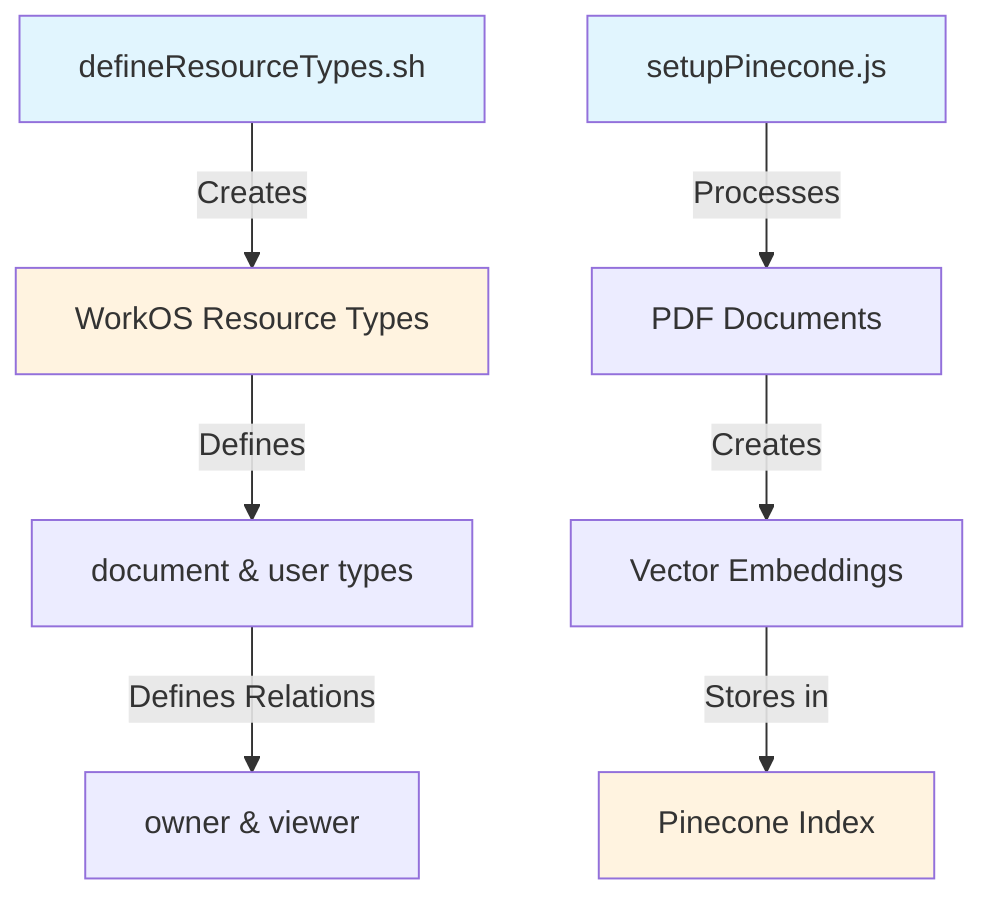
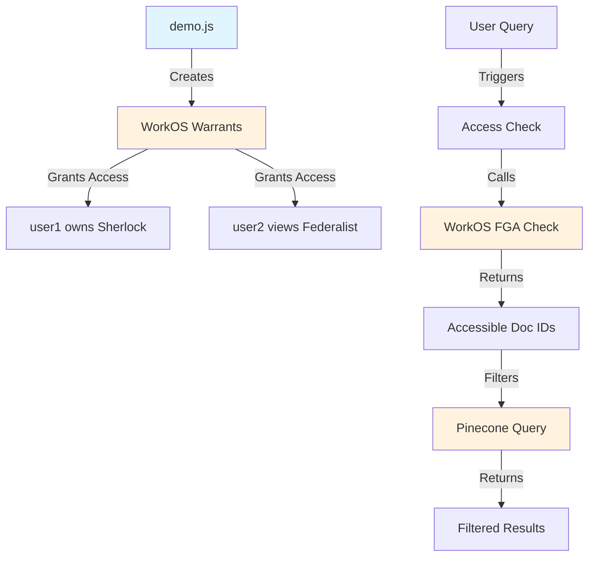

# FGA Document Access Control POC

## Overview
This proof-of-concept demonstrates fine-grained access control for document management using WorkOS FGA (Fine-Grained Authorization) integrated with Pinecone vector database. The system allows:

- Document ownership and sharing permissions
- PDF processing and chunking for vector storage
- Access-controlled vector search based on user permissions
- Demonstration of permission inheritance and access control checks

## Tech Stack
- WorkOS FGA for authorization
- Pinecone for vector storage
- LangChain for PDF processing
- Node.js/TypeScript

## Prerequisites
- Node.js v20.5.0 or newer
- WorkOS API Key
- Pinecone API Key and Environment
- zsh (for running scripts)

## Setup

1. Copy environment variables and fill in secrets:
```bash
cp .env.example .env.local
# Edit .env.local with your API keys
```

2. Set up the WorkOS authorization model:
```bash
export WORKOS_API_KEY=your_key_here
./src/scripts/defineResourceTypes.sh
```

3. Process documents and create vector embeddings:
```bash
node src/scripts/setupPinecone.js
```

4. Run the demo to test access controls and search:
```bash
node src/scripts/demo.js
```

<details>
<summary>Click to see expected demo output</summary>

```
=== Creating Basic Warrants ===
👤 Granted user1 owner access to "Sherlock Holmes" (doc_sherlock-holmes)
👤 Granted user2 viewer access to "The Federalist Papers" (doc_federalist-papers)

=== 🧪 Testing Access Controls and Search ===

=== 🔍 Searching for user user1 with query: "What are the principles of justice and liberty?" ===

=== Checking document access for user: user1 ===
✅ User user1 has access to "Sherlock Holmes" (doc_sherlock-holmes)
❌ User user1 does NOT have access to "The Federalist Papers" (doc_federalist-papers)
❌ User user1 does NOT have access to "Universal Declaration of Human Rights" (doc_universal-declaration)
✅ User can search in: Sherlock Holmes

=== Search Results ===

1. From "Sherlock Holmes":
   Score: 0.742549837
   Text: T h e   A d v e n t u r e s
o f   S h e r l o c k
H o l m e s
by Arthur Conan Doyle
Contents
I.A Scandal in Bohemia
II.The Red-Headed League

2. From "Sherlock Holmes":
   Score: 0.741582453
   Text: and seriously compromise one of the reigning families of Europe. To
speak plainly, the matter implicates the great House of Ormstein,
hereditary kings of Bohemia."
"I was also aware of that," murmured Holmes, settling himself
down in his armchair and closing his eyes...

[Additional results from Sherlock Holmes...]

=== 🔍 Searching for user user2 with query: "What are the principles of justice and liberty?" ===

=== Checking document access for user: user2 ===
❌ User user2 does NOT have access to "Sherlock Holmes" (doc_sherlock-holmes)
✅ User user2 has access to "The Federalist Papers" (doc_federalist-papers)
❌ User user2 does NOT have access to "Universal Declaration of Human Rights" (doc_universal-declaration)
✅ User can search in: The Federalist Papers

=== Search Results ===

1. From "The Federalist Papers":
   Score: 0.821266532
   Text: of love, and that the noble enthusiasm of liberty is apt to be infected
with a spirit of narrow and illiberal distrust. On the other hand, it will
be equally forgotten that the vigor of government is essential to the
security of liberty; that, in the contemplation of a sound and well-
informed judgment, their interest can never be separated...

2. From "The Federalist Papers":
   Score: 0.798069715
   Text: denominations of men among us. To all general purposes we have
uniformly been one people each individual citizen everywhere
enjoying the same national rights, privileges, and protection...

[Additional results from The Federalist Papers...]

=== 🔍 Searching for user user3 with query: "What are the principles of justice and liberty?" ===

=== Checking document access for user: user3 ===
❌ User user3 does NOT have access to "Sherlock Holmes" (doc_sherlock-holmes)
❌ User user3 does NOT have access to "The Federalist Papers" (doc_federalist-papers)
❌ User user3 does NOT have access to "Universal Declaration of Human Rights" (doc_universal-declaration)
❌ User has no document access - skipping search
```

</details>

## Usage

### Check Access Permissions
```bash
npm run check-access
```
Demonstrates checking whether users have access to specific documents.

### Process Documents
```bash
npm run process-docs
```
Process PDF documents:
- Chunks documents using LangChain
- Creates vector embeddings
- Stores in Pinecone with metadata including document ID

### Query Documents
```bash
npm run query-docs
```
Demonstrates:
- Checking user permissions before querying
- Filtering Pinecone results based on accessible documents
- Vector similarity search within permitted documents

## Project Structure
```
/fga-poc/
├── src/
│   ├── config/
│   │   └── workos.ts         # WorkOS client configuration
│   ├── scripts/
│   │   ├── defineResourceTypes.sh  # Creates FGA resource types
│   │   ├── createWarrants.ts       # Sets up test permissions
│   │   ├── checkAccess.ts         # Demonstrates access checks
│   │   ├── processDocs.ts         # PDF processing pipeline
│   │   └── queryDocs.ts           # Permission-aware querying
│   └── models/
│       └── types.ts          # TypeScript type definitions
├── package.json
├── tsconfig.json
└── README.md
```

## API Examples

### Create a Warrant
```typescript
const warrant = {
  object_type: 'document',
  object_id: 'doc1',
  relation: 'owner',
  subject_type: 'user',
  subject_id: 'user1'
};

const response = await workos.fga.batchWriteWarrants([warrant]);
```

### Check Access
```typescript
const hasAccess = await workos.fga.checkWarrant({
  object_type: 'document',
  object_id: 'doc1',
  relation: 'viewer',
  subject_type: 'user',
  subject_id: 'user1'
});
```

### Query Documents with Access Control
```typescript
const results = await queryDocuments('user1', 'search query');
```

## Development

### Adding New Resource Types
1. Add new resource type definition to `defineResourceTypes.sh`
2. Run the script to create the new type
3. Update TypeScript types in `models/types.ts`

### Adding New Relations
1. Modify the resource type definition in `defineResourceTypes.sh`
2. Delete and recreate the resource type (note: this will delete existing warrants)
3. Update relevant access check logic

## Contributing
1. Fork the repository
2. Create your feature branch
3. Commit your changes
4. Push to the branch
5. Create a new Pull Request

## License
MIT

## Architecture

### Setup Phase
1. `defineResourceTypes.sh` creates two resource types in WorkOS FGA:
   - `document`: has "owner" and "viewer" relations (owners automatically get viewer access)
   - `user`: represents system users

2. `setupPinecone.js` prepares the document data:
   - Processes PDF documents into text chunks
   - Creates vector embeddings for each chunk
   - Stores vectors in Pinecone with document IDs as metadata



### Runtime Phase
1. `demo.js` sets up access permissions:
   - Creates warrants in WorkOS FGA (e.g., "user1 owns doc_sherlock-holmes")
   - These warrants determine who can access which documents

2. When a user makes a search query:
   - System checks WorkOS FGA to get list of documents the user can access
   - Uses these document IDs to filter Pinecone search results
   - Returns only results from documents the user has permission to view



This ensures users can only search within documents they have been granted access to, either as an owner or viewer.